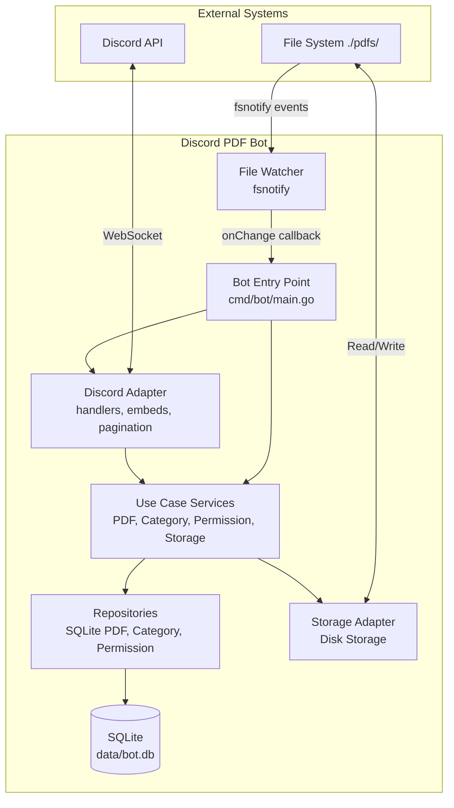
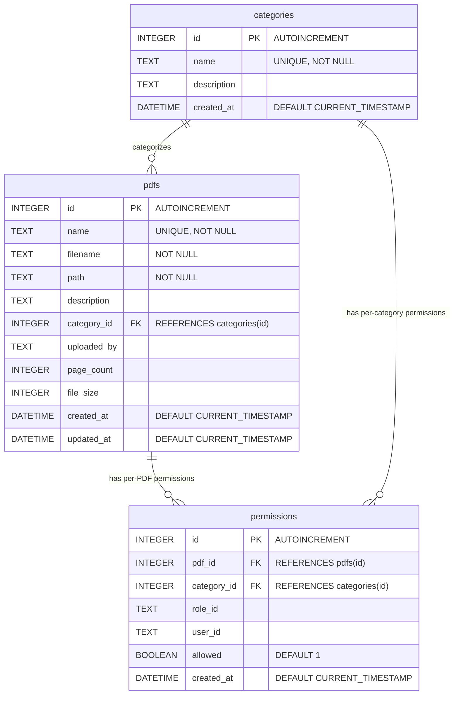
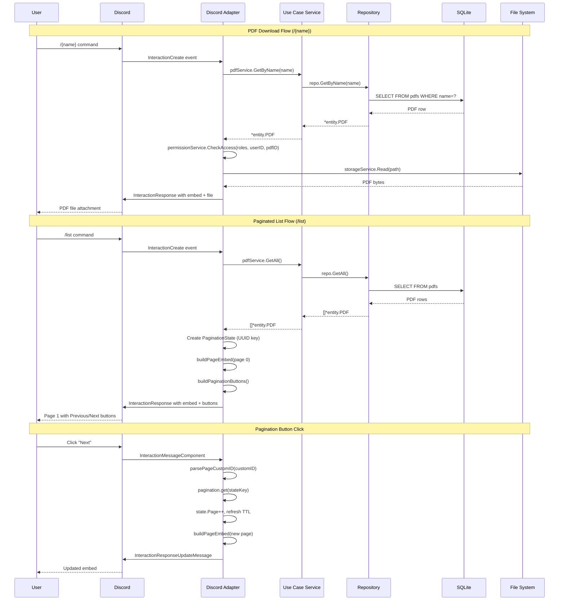
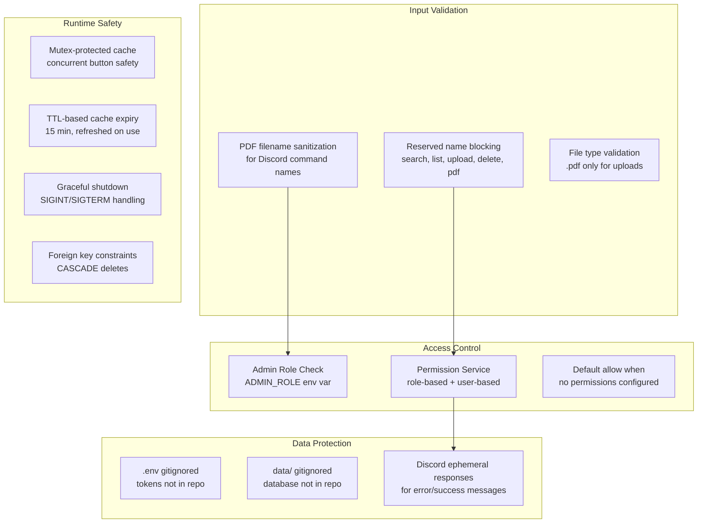

# Discord PDF Bot

A Discord bot that manages PDF files as slash commands. Drop PDFs into a folder, and the bot automatically registers them as Discord commands. Built with Go using clean architecture.

## Table of Contents

- [Features](#features)
- [Tech Stack](#tech-stack)
- [Quick Start](#quick-start)
- [Configuration](#configuration)
- [Commands](#commands)
- [Architecture](#architecture)
  - [System Architecture](#system-architecture)
  - [Backend Architecture (Layered)](#backend-architecture-layered)
  - [Database Entity Relationship](#database-entity-relationship)
  - [Request Lifecycle](#request-lifecycle)
  - [Authentication & Authorization Flow](#authentication--authorization-flow)
  - [Security Architecture](#security-architecture)
- [Project Structure](#project-structure)
- [Development](#development)

---

## Features

- **Auto-registration**: PDFs in `./pdfs/` become Discord slash commands automatically
- **Hot-reload**: Filesystem watcher detects changes and syncs commands in real-time
- **Search**: Full-text search across PDF names and descriptions
- **Categories**: Organize PDFs into categories with filtered listing
- **Permissions**: Role-based and user-based access control per PDF or category
- **Pagination**: Button-based pagination for `/list` and `/search` commands
- **Admin commands**: Upload, delete, and edit PDF metadata via Discord
- **Metadata storage**: SQLite database for PDF metadata, categories, and permissions

---

## Tech Stack

| Component | Technology |
|-----------|-----------|
| Language | Go 1.24+ |
| Discord API | [discordgo](https://github.com/bwmarrin/discordgo) v0.29.0 |
| Database | SQLite via [modernc.org/sqlite](https://pkg.go.dev/modernc.org/sqlite) (pure Go, no CGO) |
| File Watching | [fsnotify](https://github.com/fsnotify/fsnotify) v1.9.0 |
| UUID | [google/uuid](https://github.com/google/uuid) |

---

## Quick Start

```bash
# Clone
git clone https://github.com/your-username/discord-pdf-bot.git
cd discord-pdf-bot

# Configure
cp .env.example .env
# Edit .env with your bot token and guild ID

# Add PDFs
mkdir -p pdfs
cp your-files/*.pdf pdfs/

# Run
go run cmd/bot/main.go
```

---

## Configuration

Environment variables (set in `.env`):

| Variable | Required | Default | Description |
|----------|----------|---------|-------------|
| `DISCORD_BOT_TOKEN` | Yes | — | Discord bot token from Developer Portal |
| `GUILD_ID` | Yes | — | Discord server ID for command registration |
| `ADMIN_ROLE` | No | `PDF Admin` | Role name for admin commands |

Files:

| Path | Purpose |
|------|---------|
| `pdfs/` | PDF storage directory (contents = slash commands) |
| `data/bot.db` | SQLite database (auto-created) |
| `.env` | Environment variables (gitignored) |

---

## Commands

| Command | Options | Access | Description |
|---------|---------|--------|-------------|
| `/{name}` | — | Permission-checked | Download a specific PDF |
| `/list` | `category` (optional) | Everyone | List all PDFs, optionally filtered by category |
| `/search` | `query` (required) | Everyone | Search PDFs by name or description |
| `/upload` | `file`, `description` (optional) | Admin only | Upload a new PDF |
| `/delete` | `name` | Admin only | Delete a PDF |
| `/pdf info` | `name` | Everyone | Show PDF metadata |
| `/pdf edit` | `name`, `field`, `value` | Admin only | Edit PDF description or category |

---

## Architecture

### System Architecture



### Backend Architecture (Layered)

```mermaid
graph TB
    subgraph "Adapter Layer"
        direction TB
        DA[Discord Adapter<br/>bot.go, handlers.go<br/>embeds.go, pagination.go]
        RA[Repository Adapter<br/>sqlite_pdf.go<br/>sqlite_category.go<br/>sqlite_permission.go]
        SA[Storage Adapter<br/>disk_storage.go]
    end

    subgraph "Infrastructure Layer"
        direction TB
        DB[Database<br/>sqlite.go<br/>connection, migrations]
        FW[File Watcher<br/>fsnotify.go<br/>debounced watching]
    end

    subgraph "Use Case Layer"
        direction TB
        PS[PDFService<br/>CRUD, search, sync]
        CS[CategoryService<br/>CRUD, validation]
        PerS[PermissionService<br/>access control]
        SS[StorageService<br/>file operations]
    end

    subgraph "Domain Layer"
        direction TB
        E[Entities<br/>PDF, Category<br/>Permission]
        P[Ports/Interfaces<br/>PDFRepository<br/>CategoryRepository<br/>PermissionRepository<br/>StoragePort]
        Err[Domain Errors<br/>ErrPDFNotFound<br/>ErrDuplicateName<br/>ErrPermissionDenied]
    end

    DA --> PS
    DA --> CS
    DA --> PerS
    DA --> SS
    PS --> P
    CS --> P
    PerS P
    SS --> P
    RA -->|implements| P
    SA -->|implements| P
    RA --> DB
    SA --> FS[(File System)]
    DB --> E
```

**Dependency Rule**: Dependencies point inward. Domain layer has zero external dependencies. Adapters implement domain ports.

### Database Entity Relationship



**Indexes**:
- `idx_pdfs_name` on `pdfs(name)`
- `idx_pdfs_category` on `pdfs(category_id)`
- `idx_permissions_pdf` on `permissions(pdf_id)`
- `idx_permissions_category` on `permissions(category_id)`

**Default Data**: A "default" category is seeded on first migration.

### Request Lifecycle



### Authentication & Authorization Flow

```mermaid
flowchart TD
    A[User invokes slash command] --> B{Command type?}
    B -->|/{name}| C[Get PDF by name]
    B -->|/upload, /delete, /pdf edit| D{Admin check}
    B -->|/list, /search, /pdf info| E[Allow - public commands]

    C --> F[Get user roles from interaction]
    F --> G[permissionService.CheckAccess]

    G --> H{Permissions exist for PDF?}
    H -->|No| I[Default: ALLOW]
    H -->|Yes| J{User ID match?}
    J -->|Yes, allowed| I
    J -->|Yes, denied| K[DENY]
    J -->|No| L{Role ID match?}
    L -->|Yes, allowed| I
    L -->|Yes, denied| K
    L -->|No match| M[DENY - no matching rule]

    D --> N{User has ADMIN_ROLE?}
    N -->|Yes| O[Allow]
    N -->|No| P[Deny - insufficient permissions]

    I --> Q[Execute command]
    K --> R[Respond: permission denied]
    O --> Q
    P --> R

    style I fill:#57F287,color:#000
    style K fill:#ED4245,color:#fff
    style O fill:#57F287,color:#000
    style P fill:#ED4245,color:#fff
```

### Security Architecture



---

## Project Structure

```
discord-pdf-bot/
├── cmd/bot/
│   └── main.go                     # Entry point, DI wiring
├── internal/
│   ├── adapter/
│   │   ├── discord/
│   │   │   ├── bot.go              # Bot setup, command registration
│   │   │   ├── handlers.go         # Slash command & button handlers
│   │   │   ├── embeds.go           # Discord embed builders
│   │   │   ├── pagination.go       # Pagination state & helpers
│   │   │   └── pagination_test.go
│   │   ├── repository/
│   │   │   ├── sqlite_pdf.go       # PDF repository implementation
│   │   │   ├── sqlite_pdf_test.go
│   │   │   ├── sqlite_category.go  # Category repository
│   │   │   └── sqlite_permission.go # Permission repository
│   │   └── storage/
│   │       └── disk_storage.go     # File system storage
│   ├── domain/
│   │   ├── entity/
│   │   │   ├── pdf.go              # PDF entity
│   │   │   ├── category.go         # Category entity
│   │   │   └── permission.go       # Permission entity
│   │   ├── port/
│   │   │   ├── pdf_repository.go   # PDF repository interface
│   │   │   ├── category_repository.go
│   │   │   ├── permission_repository.go
│   │   │   └── storage.go          # Storage port interface
│   │   └── errors.go               # Domain errors
│   ├── infrastructure/
│   │   ├── database/
│   │   │   └── sqlite.go           # SQLite connection & migrations
│   │   └── watcher/
│   │       └── fsnotify.go         # File system watcher
│   └── usecase/
│       ├── pdf_service.go          # PDF business logic
│       ├── pdf_service_test.go
│       ├── category_service.go     # Category business logic
│       ├── permission_service.go   # Permission business logic
│       └── storage_service.go      # Storage service wrapper
├── docs/
│   └── superpowers/
│       ├── plans/                  # Implementation plans
│       └── specs/                  # Design specs
├── pdfs/                           # PDF storage directory
├── data/                           # SQLite database (gitignored)
├── .env.example                    # Environment template
├── .gitignore
├── go.mod
├── go.sum
└── CLAUDE.md                       # AI assistant instructions
```

---

## Development

```bash
# Run
go run cmd/bot/main.go

# Build
go build -o discord-pdf-bot ./cmd/bot/

# Test
go test ./... -v

# Run single test
go test ./internal/adapter/discord/ -v -run TestPaginationCache

# Dependencies
go mod tidy
```

### Architecture Principles

- **Clean Architecture**: Domain layer has zero dependencies. Ports define interfaces, adapters implement them.
- **Dependency Injection**: All wiring in `cmd/bot/main.go`. Services receive ports, not concrete implementations.
- **Single Responsibility**: Each file has one clear purpose. Handlers handle, services orchestrate, repositories persist.
- **Testability**: Interfaces allow mocking. In-memory SQLite for tests.
